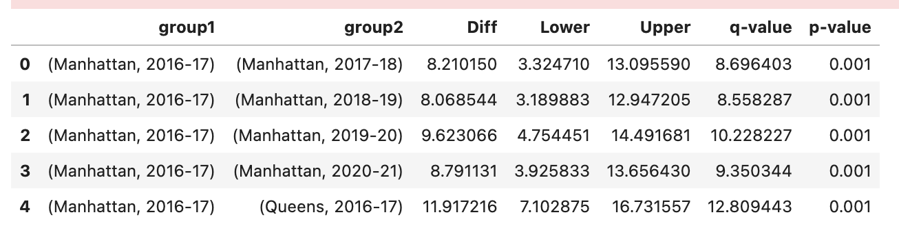
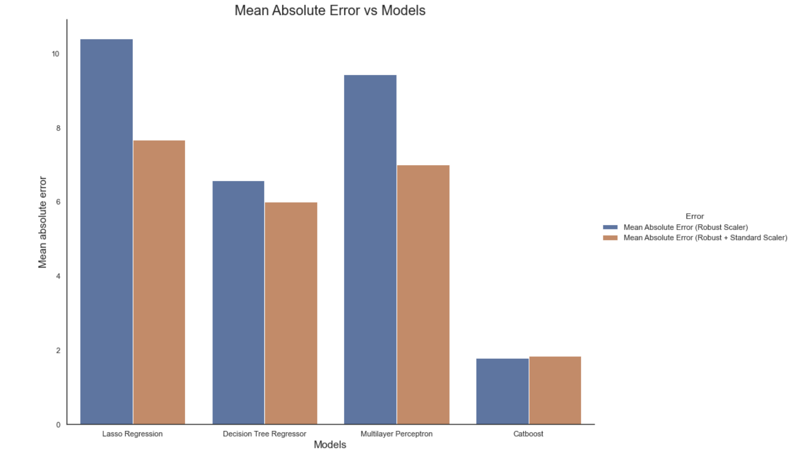
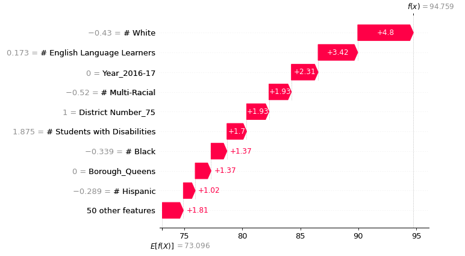

# New York City Poverty Analysis
## To see the code, go to NewYorkCity_Education -> Notebook
## Presentation Link (PowerBI Dashboard Included)
https://docs.google.com/presentation/d/1WPH86ztb6moK_XAzu9qXV_ljrouvJ34cMiXuZLB_t68/edit?usp=sharing

Economic Need Index is the measure of the socioeconomic circumstances of a school’s population and the score is assigned to each school on the number of students eligible for free lunch or public assistance or who live in temporary housing. Through the Demographic Snapshot District data, I extracted useful insights and created visualizations through Tableau, matplotlib and Seaborn. I also performed statistical tests and built machine learning models that can predict the economic need index. 

# 1. Data Source
NYC open data is a open data with free published data in New York City. City organizations and people often utilize this website to gather data to extract useful insights about the city in New York. 

# 2. Method
Used a data sheet with demographics for 1831 schools from years 2016 - 2021. The column economic need index is the target variable which is the key value of this project. I was able to predict which borough will have small or large economic need index value with my domain knowledge. The aim of this project is to come up with ideas of solutions for the borough with the highest economic need value by building a regression model to predict the economic need index value. 

# 3. Data Wrangling (simple - to understand data)

• Used Describe() and Info() functions to see the types of columns and the statistical summary for numeric values. 
- Changed the data types for columns that weren't having 

• NaN's and Duplicated rows - There were 0 NaN values and no duplicate rows. However, if there were, for the numeric values, it would be better to imput with median values because of the presence of outliers. For the categorical features, I would simply use the df['col name'].mode(). 

• Column restructuring and filling or removing data gaps 
- 1. Switched the numeric values into percentages for simpler analysis.
- 2. Splitted the columns into separate columns using regex.
- 3. Created another column of economic need index with binary values. No Need support < mean < Need support

• Outliers - Most of the ourliers were within the 95% confidence interval. Eliminating those data points out of the 95 percent qunaitle range would be ideal but I kept it since those data points could be conatining valuable information. 

• Visualization - Quick visualization through histograms to see variances for each columns

• Merged the data sheets

# 4. Exploratory Data Analysis
• Correlation heat map 

- Visualized correlations
- Especially the ones that were correlated with Economic Need Index
- Povert rate and Economic Need Index are strongly positively correlated to each other.

• Borough Analysis
- Visualized the relationship between Boroughs and Economic Need Index from years 2016 to 2021. 

- The descending order of economic need index is Bronx -> Brooklyn -> Manhattan -> Queens -> Staten Island
- Visualized the relationship between Grades and Economic Need Index for each boroughs from years 2016 - 2021.
- 
- Most of the boroughs had decreasing trend of high school students

- Visualized the relationship between Sex and Economic Need Index for each boroughs from years 2016 - 2021.

- More males needed support.

-Visualized the relationship betwee Economic Need Index and student with disabilities 

- Visualized the relationship between students who are english learners and Economic Need Index

• Two tailed ANOVA test

- Borough and Year

- The p values obtained from ANOVA test for Borough, years, and Economic Need Index were statistically significant (p<0.05). We conclude that each Boroughs significantly affects the Economic Need Index outcome, time (years) significantly affects the Economic Need Index outcome, and both Borough and time (years) as a group significantly affects the yield outcome.

• Multiple pairwise comparisons (Post-hoc test) Permalink¶
Now, we know that Borough and time (years) differences are statistically significant, but ANOVA does not tell which Borough and time (years) are significantly different from each other. To know the pairs of significant different Borough and time (years), perform multiple pairwise comparison (Post-hoc comparison) analysis using Tukey’s HSD test.

• The null hypothesis is that there are no statistical difference between each groups.

- All the years are statistically different to each other by its economic need index by it's p value which is less than 0.05. 

- All boroughs are statisticall different to each other by its ecoonomic need index by it's p value which is less than 0.05. 

# 5. Preprocess
• Feature Engineering
- Train/Validation/Test set are divided in a 80/10/10 ratio.
- Numeric features 
  - scaling 
    - 1. Robust Scaler -> Standard Scaler
    - 2. Robust Scaler
    
Some say that robust scaling(removes outliers)  and then standard scaling(converting into units by getting rid of mean value and std = 1) can give better results. But you never know until you try it out first. 

- Categorical features - encoding - One Hot Encoding

# 6. Algorithms and Machine Learning
• Started from High interpretability, low accuracy model to low interpretability, high accuracy model. 
• Simpler the model the better it is because it prevents overfitting, higher interpretability, and more computational efficiency.

Used Optuna (software framework for hyperparamter tuning) to perform Bayesian Optimization instead of GridSearchCV.

Process:
• Started with the linear regression model -> decision tree regressor -> Catboost(boosting) -> Neural Network(Multilayer Perceptron)

The scores decreased gradually. Catboost had the best MAE score therefore, Catboost is the best performing model. Multilayer perceptron showed overfitting and the other two models (linear regressiona dn decision tree) showed higher MAE value than CatBoost. 

# 7. Evaluation 

.jpeg)

Cat Boost is the best model that performed with a MAE value of 1.7

These are the feature importance. 

The feature importance Visualization can be done using SHAP values. SHAP (SHapley Additive exPlanations) is a game theoretic approach to explain the output of any machine learning model. 

But SHAP values do not provide causality it just tells the contribution. So I had to make sure what determines the economic need index and use SHAP for visualization purposes. 

The descening order of the SHAP value: # White -> # English Language Learners -> Year 2016-2017.

# 8. Solution

Now it's time to give out a possible solution for Bronx. I have to remember that the main goal of this project was to build a predictive regression model that can predict the economc need index and make conclusions to inform the results to NYC.

I provided four possible solutions to decrease the borough - Bronx. Through Exploratory Data Analysis, I figured the population of white, hispanic, English Learners, grades between 9 - 12 were the major difference between boroughs with high economic need index and low economic need index. So I did some experiments over these values. I adjusted these variables and used my CatboostRegressor model to predict the economic need index for the adjusted values.

## 4 solutions which can help decrease the economic need index:

### 1. Increase the number of White population

• By increasing the white population by 0.3 in the Standardized condition where mean = 0 and std = 1, there was a decrease in economic need index by 8.35%

### 2. Decrease the number of Black population

• Decreasing the black people population by 0.4 decreases the economic need index by 2% in the standardized condition where mean = 0 and std = 1.

### 3.Decrease the number of Hispanic population

• Decreasing the Hispanic population by 0.4, Economic need index is decreased by 0.783% in the standardized condition (mean = 0 and std = 1).

### 4. Decrease the number of english learners

• Decreasing the english learners by 0.26 decreaased the economic need index by 11% in the given condition where mean = 0 and std = 1.

